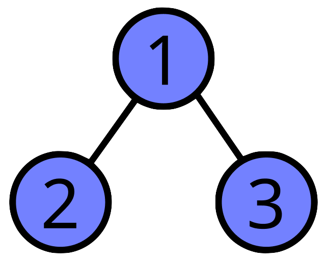

<h1 align="center">Binary Trees</h1>

**Binary Trees** are a tree data structure in which each node has at most two children, which are referred to as the left child and the right child.

### Why use a tree?

Unlike the standard linear data structures (Arrays, Linked Lists, Stacks, and Queues), Binary Trees are hierarchical data structures designed for efficiency in searching and sorting, as well as their ability to hold excessively more data than standard linear structures.

## Structure

A binary tree is a collection of nodes, connected to one another through the use of pointers. The top most node is referred to as the root, which is where the tree begins. Each node connected under another node is referred to as either the left or right child of said node. Finally a nodewith no children is referred to as a leaf node, as it is at the end of the tree. 

So we've described a tree as a collection of nodes, but what exactly does a node look like?

Each node has three main parts.

### Nodes

1. Data: The value being contained within said node
2. Left Pointer: Connection to left child
3. Right Pointer: Connection to right child

In Python we would represent a node as a class structure like this:

```python
class Node:
	def __init__(self, data):
		self.data = data
		self.left = None
		self.right = None
```

So as a binary tree is just a collection of nodes connected to one another through the use of pointers, creating a tree is as simple as:

```python
root_node = Node(1)
root_node.left = Node(2)
root_node.right = Node(3)
```

And there we go, we have a tiny little tree that looks something like this



We can continue to grow the tree out further by just adding more nodes to the newly defined children of our root.

```python
root_node.left.left = Node(4)
root_node.left.right = Node(5)
root_node.right.left = Node(6)
root_node.right.right = Node(7)
```

## Types of Binary Trees

Just like in the real world there is more than one kind of tree, and in computing there are also many kinds of trees. There are five main types of binary tree that you should be aware of:

### Full Binary Tree

A full binary tree is a tree where all the nodes have either two or no children attached to them. A cleaner way of thinking about this is just that every node has two children but the leaf nodes have  none.

Good thing to remember when it comes to full trees is that the number of leaf nodes is equal to the number of total internal nodes plus one. For the more mathematically inclined:

$L = I + 1$ (L is the number of leaf nodes, I is the number of internal nodes)

### Complete Binary Tree

A complete binary tree is a binary tree in which every level, except possibly the last, is completely filled, and all nodes are as far left as possible. In layman's terms, every level in the tree is equal except for the last one, where those nodes are pushed to the left as much as they can go. 

Not the kind of tree you'll be asked about very often but good to know none the less.

### Perfect Binary Tree

A perfect binary tree is a tree where all branches are filled, and all leaf nodes are on the same level. This is just a nice term for the tree looks like a perfect triangle without anything missing from it

### Degenerate/Pathological Binary Tree

These are trees that all the nodes have only one connection on the same side creating a single long string of values. When this happens congratulations, you have created a bad linked list.

### Balanced Binary Tree

Now these are harder to explain…

Balanced binary trees are important because they allow for incredibly fast traversal when searching, sorting, inserting, and deleting, as their height can be described as having a complexity of $O(Log(n))$. 

Efficiency wise these are brilliant and there is a whole area of self balancing tree structures that I can't exactly go into here right now. These are rarely a first year topic so it shouldn't be too big of a worry for students right away. 
